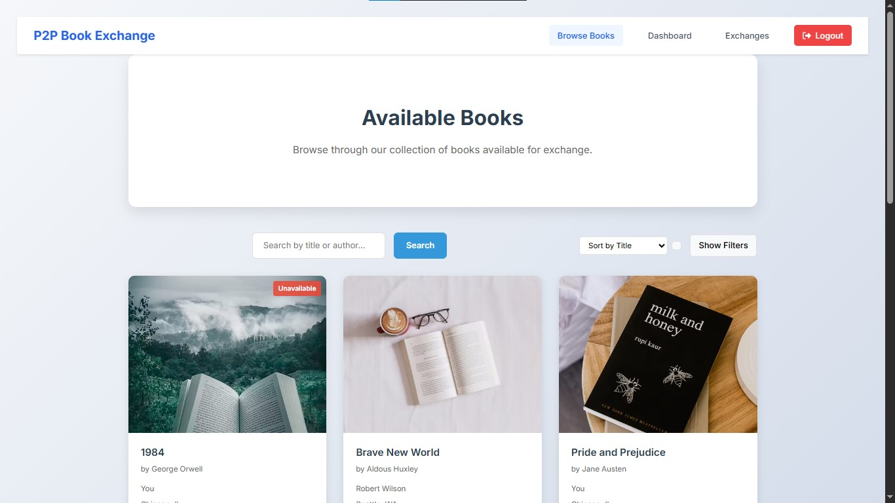

# P2P Book Exchange App

A modern web application that facilitates peer-to-peer book exchanges between users. Built with Next.js, Express, and MongoDB.

🌐 [Live Demo](https://p2p-book-exchange.vercel.app) | [Backend API](https://p2p-book-exchange-backend.onrender.com)

## Features

### Authentication
Secure user authentication with role-based access control.

<div align="center">
  
  
</div>

### Home Page
Welcoming interface with featured books and easy navigation.

<div align="center">
  
  
</div>

### Book Management
Easy-to-use interface for managing your book collection.

<div align="center">
  
  
</div>

### Book Discovery
Browse and search through available books.

<div align="center">
  
</div>

### Exchange System
Seamless book exchange process between users.

<div align="center">
  
  
  
</div>

## Tech Stack

- **Frontend**: Next.js, React, CSS Modules
- **Backend**: Node.js, Express
- **Database**: MongoDB
- **Authentication**: JWT
- **File Storage**: Local storage with image optimization

## Getting Started

### Prerequisites

- Node.js (v14 or higher)
- MongoDB
- npm or yarn

### Installation

1. Clone the repository:
   ```bash
   git clone https://github.com/Akshat394/p2p-book-exchange-app.git
   cd p2p-book-exchange-app
   ```

2. Install dependencies:
   ```bash
   # Install backend dependencies
   cd backend
   npm install

   # Install frontend dependencies
   cd ../frontend
   npm install
   ```

3. Set up environment variables:
   - Create `.env` file in the backend directory
   - Add the following variables:
     ```
     MONGODB_URI=your_mongodb_uri
     JWT_SECRET=your_jwt_secret
     PORT=5000
     ```

4. Start the development servers:
   ```bash
   # Start backend server
   cd backend
   npm run dev

   # Start frontend server
   cd frontend
   npm run dev
   ```

5. Open [http://localhost:3000](http://localhost:3000) in your browser

## Features

- User authentication (login/register)
- Role-based access (book owners and seekers)
- Book management (add, edit, delete)
- Book search and filtering
- Book exchange requests
- Real-time notifications
- Responsive design

## Project Structure

```
p2p-book-exchange-app/
├── frontend/           # Next.js frontend application
│   ├── components/    # React components
│   ├── pages/        # Next.js pages
│   ├── styles/       # CSS modules
│   └── public/       # Static assets
├── backend/          # Express backend application
│   ├── routes/      # API routes
│   ├── data/        # JSON data files
│   └── server.js    # Express server
└── README.md        # Project documentation
```

## Contributing

1. Fork the repository
2. Create your feature branch (`git checkout -b feature/AmazingFeature`)
3. Commit your changes (`git commit -m 'Add some AmazingFeature'`)
4. Push to the branch (`git push origin feature/AmazingFeature`)
5. Open a Pull Request

## License

This project is licensed under the MIT License - see the [LICENSE](LICENSE) file for details.

## Acknowledgments

- Next.js team for the amazing framework
- MongoDB for the database
- All contributors and users of the application

## Deployment

The application is deployed and accessible at:

- **Frontend**: [https://p2p-book-exchange.vercel.app](https://p2p-book-exchange.vercel.app)
- **Backend API**: [https://p2p-book-exchange-backend.onrender.com](https://p2p-book-exchange-backend.onrender.com)

### Deployment Instructions

#### Frontend (Vercel)

1. Fork this repository
2. Create a Vercel account at [vercel.com](https://vercel.com)
3. Connect your GitHub account to Vercel
4. Import this repository in Vercel
5. Configure the following environment variables:
   - `NEXT_PUBLIC_API_URL`: Your backend API URL

#### Backend (Render)

1. Create a Render account at [render.com](https://render.com)
2. Create a new Web Service
3. Connect your GitHub repository
4. Configure the following environment variables:
   - `MONGODB_URI`: Your MongoDB connection string
   - `JWT_SECRET`: Your JWT secret key
   - `PORT`: 5000
   - `CORS_ORIGIN`: Your frontend URL

---

Made with ❤️ by Akshat Trivedi 